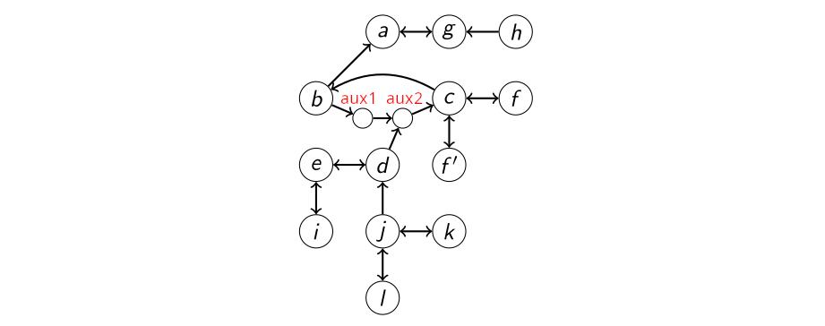

# Studies in clustered Argumentation Frameworks

## TL;DR

* We try to simplify Dung-Style Argumentation Frameworks (AFs) by partitioning arguments into clusters
* We implement conflict-free, admissible and stable semantics for clustered arguments
* We implement a method to identify spurious partitions which do not preserve the semantics of the original AF
* We implement methods to automatically compute non-spurious partitions
* All implementations are done in Answer Set Programming (ASP) and Python 3

## Preliminaries

In this chapter we recite the central definitions from [^1].

### Argumentation frameworks

Given a finite set of arguments $A$ and
an attack relation $R \subseteq A \times A$ we define
an argumentation framework (AF) as
$F = (A,R)$
per usual [^1].

We consider conflict-free, admissible and stable extensions
(respectively $cf(F), adm(F), stb(F) \subseteq 2^A$)
defined in the standard way based on the characteristic function
$\mathcal F _F (S) = \\{ x \in A \mid \forall (y,x) \in R : \exists z \in S : (z,y) \in R \\}$.
* $cf(F) = \\{ S \subseteq A \mid \forall a,b \in S : (a,b) \not \in R \\}$
* $adm(F) = \\{ S \in cf(F) \mid S \subseteq \mathcal F _F (S) \\}$
* $stb(F) = \\{ S \in cf(F) \mid \forall a \in A \setminus S : \exists (b,a) \in R : b \in S \\}$

We will refer to these definition as the "classical" or "concrete" ones, 
as opposed to the "clustered" ones defined next.

### Existentially clustered Argumentation Frameworks

Based on a classical $F = (A,R)$
and a surjective mapping $m : A \mapsto \hat A$
we define a clustered AF $\hat F = (\hat A, \hat R)$ with
$\hat R =  \\{ (\hat a, \hat b) \mid (a, b) \in R \land m(a) = \hat a \land m(b) = \hat b \\}$ [^1].

For convenience we extend $m$ as follows:
* $m(S) = \\{ m(a) \mid a \in A \\}$
* $m(F) = \hat F = (\hat A, \hat R)$

The mapping $m$ and the clustered arguments $\hat a \in \hat A$ induce a partition over the classical arguments:
$A = \biguplus _ {\hat a \in \hat A} m^{-1}(\hat a)$.
Let $single(\hat A) = \\{ \hat a \in \hat A \mid |m^{-1}(\hat a)| = 1 \\}$
denote the set of singleton clustered arguments.

We define conflict-free, admissible and stable extensions for the clustered AF
(respectively $\hat {cf}(\hat F), \hat {adm}(\hat F), \hat {stb}(\hat F) \subseteq 2^{\hat A}$).
* $\hat {cf}  ( \hat F) = \\{ \hat E \subseteq \hat A \mid \forall \hat a, \hat b \in single(\hat E): (\hat a, \hat b) \not \in \hat R \\} $
* $\hat {adm} ( \hat F) = \\{ \hat E \in \hat {cf} ( \hat F) \mid \forall \hat a \in single(\hat E) : (\hat b, \hat a) \in \hat R \rightarrow \exists \hat c \in \hat E : (\hat c, \hat b) \in \hat R \\} $
* $\hat {stb} ( \hat F) = \\{ \hat E \in \hat {cf} ( \hat F) \mid ( \hat b \not \in \hat E \rightarrow \exists \hat a \in \hat E : (\hat a, \hat b) \in \hat R) \land (\forall \hat \a \in \hat E : (\lnot \exists \hat x \in \hat E : (\hat x, \hat a) \in \hat R) \land (\hat a, \hat b) \in \hat R \land \hat b \in single(\hat A) ) \rightarrow \hat b \not \in \hat E \\}$

Finally, for some $F$, mapping $m$  and classical (resp. clustered) semantics $\sigma(F)$ ( $\hat \sigma (m(F))$ ), 
we say that:
* $\hat E \in \hat \sigma (m(F))$ is spurious w.r.t. $F$ under $\sigma$ if $\not \exists E \in \sigma (F) : m(E) = \hat E$
* $m(F)$ under $\hat \sigma$ is faithful w.r.t. $F$ under $\sigma$ if there is no spurious $\hat E \in \hat \sigma ( \hat m(F) )$ w.r.t $F$ under $\sigma$.

### Examples 

We use several examples from Saribatur and Wallner 2021[^1].

* Figure 1 in the paper can be found as `examples/e1...` in the code. The meaning of the different `.lp` files are explained below.

* Figure 3 in the paper can be found as `examples/e3...` in the code. The meaning of the different `.lp` files are explained below.

* The Simonshaven case from Prakken 2019[^3] serves as a practical application of the abstraction techniques. It was convereted into a classical-Af format by Saribatur and Wallner in their lecture notes (no public reference).

### Simonshaven example

## Implementation of clustered semantics

The answer set programs for $F=(A,R)$ and $m : A \mapsto \hat A$ are defined as follows:
* $\pi_F = \\{ \textbf{arg} (a). \mid a \in A \\} \cup \\{ \textbf{att} (a,b). \mid (a,b) \in R \\}$.
* $\pi_m = \\{ \textbf{abs\\_map} (a, \hat a). \mid a \in A, m(a) = \hat a \\}$

Programs of this type can be found in the `/examples` and `/tests` directories.

The induced $m(F) = \hat F = (\hat A, \hat R)$ can be computed with:

	abs_arg(X) :- abs_map(_,X).
	singleton(X) :- 1 = #count { Y : abs_map(Y,X) }, abs_arg(X).
	abs_att(X',Y') :- att(X,Y), abs_map(X,X'), abs_map(Y,Y').
	
The above program can be found in `to-clustered-af.lp`. 
In the text we refer to it also as $\pi_{m(F)}$.

All semantics-programs can be found in the folder `/semantics`.
The classical semantics are defined as usual[^2],
where $\textbf{in} (a)$ is true in some answer set iff $a \in S$ 
for the extension $S$ that corresponds to that answer set.

We will refer to the ASP encodings of the 
classical semantics as 
$\pi_{\sigma}$ for $\sigma \in \\{ cf, adm, stb \\}$
and for clustered semantics as 
$\pi_{\hat \sigma}$ for $\hat \sigma \in \\{ \hat{cf}, \hat{adm}, \hat{stb} \\}$.

The extensions are computed as follows:

* $\sigma (F) \cong \mathcal{AS} ( \pi_F \cup \pi_{\sigma} )$
* $\sigma (m(F)) \cong \mathcal{AS} ( \pi_F \cup \pi_m \cup \pi_{m(F)} \cup \pi_{\hat \sigma} )$

### Clustered Conflict-Free and Clustered Admissible Semantics

The ASP implementation of these semantics are described in Saribatur and Wallner 2021[^1].
For the Clustered Conflict-Free case we have:

	{ abs_in(X) : abs_arg(X) }.
  	:- abs_in(X), abs_in(Y), abs_att(X,Y), singleton(X), singleton(Y).
	
For the Clustered Admissible semantics we extend the above by:

	abs_defeated(X) :- abs_in(Y), abs_att(Y,X), singleton(Y).
	{ abs_defeated(X) } :- abs_in(Y), abs_att(Y,X), not singleton(Y).
	:- abs_in(X), abs_att(Y,X), not abs_defeated(Y), singleton(X).

### Clustered Stable Semantics

These semantics were the first implementation task for this project.
It was implemented as follows:

	{ abs_in(X) : abs_arg(X) }.
	:- abs_in(X), abs_in(Y), abs_att(X,Y), singleton(X), singleton(Y).
	abs_in(Y) :- abs_arg(Y), not abs_in(X) : abs_att(X,Y).
	abs_defeated(Y) :- abs_in(X), abs_att(X,Y).
	not abs_in(B) :- abs_in(A), not abs_defeated(A), abs_att(A,B), singleton(B).
  
The third line was inspired by the ASPARTIX-Implementation of the classical stable semantics[^2].

To ensure correctness, we tested the semantics with several instances:
 * `tests/cstable-1` ensures the clustered semantics reduce to the classical ones when every clustered argument is singleton
 * `/tests/cstable-2` ensures that not-attacked clusters are always accepted, always-attacked singletons are never accepted and always-attacked clusteres can be both accepted or not.
 * `/tests/cstable-3` and `/tests/cstable-4` have different concrete AF's but their mapping induces the same clustered AF. Thus, their clustered semantics should yield the same extensions.

To run the tests, execute in a terminal:

	. 1-clustered-stable-semantics-examples.sh

## Identifying spurious clustered extensions

Given some $F$, $m$, $\hat F = m(F), \sigma$ and $\hat E \in \hat \sigma (\hat F)$.
How can we know whether the extension $\hat E$ is spurious?
We need to find an $E \in \sigma(F)$ such that $m(E) = \hat E$ if no such $E$ can be found, 
we know that $\hat E$ is spurious..

Recall the ASP encodings defined above:
* $\pi_F = \\{ \textbf{arg} (a). \mid a \in A \\} \cup \\{ \textbf{att} (a,b). \mid (a,b) \in R \\}$.
* $\pi_m = \\{ \textbf{abs\\_map} (a, \hat a). \mid a \in A, m(a) = \hat a \\}$
* $\pi_{m(F)}$ (found in `to-clustered-af.lp`) to deduce $\textbf{abs\\_arg}/1$, $\textbf{singleton}/1$ and $\textbf{abs\\_att}/2$.
* $\pi_{\sigma}$ to deduce $\textbf{in}/1$
* $\pi_{\hat \sigma}$ to deduce $\textbf{abs\\_in}/1$

Consider the program 
$\pi_F \cup \pi_m \cup \pi_{m(F)} \cup \pi_\sigma \cup \pi_{\hat \sigma}$.
The answer sets of this combination yield the cross product of classical and clustered extensions
$(X, \hat X) \in \sigma(F) \times \hat \sigma( \hat F)$.

Second, we need to eliminate combinations of $X$ and $\hat X$ where $m(X) \not = \hat X$.
This is done by adding two constraints:

	:- abs_in(X'), 0 = #count{ X: in(X), abs_map(X,X')}.
 	:- in(X), abs_map(X,X'), not abs_in(X').
	
Let's refer to these two constraints as $\pi_{m(X) = \hat X}$.

Finally, we need to constrain the search to clustered extensions that map to $\hat E$.
Let's encode $\hat E$ as the answer set program 
$\pi_{\hat E} = \\{ \textbf{abs\\_in}(\hat a) \mid \hat a \in \hat E \\} \cup \\{ \textbf{-abs\\_in}(\hat a) \mid \hat a \in \hat A \setminus \hat E  \\}$
and add it to constrain the answer sets accordingly.
The final procedure is:

$\mathcal {AS} ( \pi_F \cup \pi_m \cup \pi_{m(F)} \cup \pi_\sigma \cup \pi_{\hat \sigma} \cup \pi_{m(X) = \hat X} \cup \pi_{\hat E} ) \cong \\{ X, \hat X \mid X \in \sigma(F) \land \hat X \in \hat \sigma(\hat F) \land m(X) = \hat X \land \hat X = \hat E \\}$

If there are no answer sets, then no $X$ corresponding to $\hat E$ could be found, 
i.e. $\hat E$ is spurious.

To see examples of this, investigate and run `2-is-extension-spurious.sh`.

## Identifying spurious abstraction mappings

Given some $F$, $m$, $\hat F = m(F)$ and $\sigma$ we would like 
to know whether some $\hat E \in \hat \sigma (\hat F)$ is spurious.

The above procedure can be extended to achieve this by looping though the clustered extensions:

> for $\hat E \in \mathcal {AS} ( \pi_F \cup \pi_m \cup \pi_{m(F)} \cup \pi_{\hat \sigma} )$:
>> $Q \leftarrow \mathcal {AS} ( \pi_F \cup \pi_m \cup \pi_{m(F)} \cup \pi_\sigma \cup \pi_{\hat \sigma} \cup \pi_{m(X) = \hat X} \cup \pi_{\hat E} )$
>>
>> if $Q = \emptyset$ return "spurious!"
>>
> return "not spurious!"

This was implemented as a python program using `clingo` as answer set solver.
The code can be found in `find_spurious.py`.
Note that the procedure requres two nested calls to the `clingo` solver. 
The outer call is for computing the clustered extensions, 
the inner call to check whether that extension is spurious or not.

Note that besides $\pi_{\hat E}$, the inner ASP encoding is invariant  
during the loop iteration.
Thus, we utilize clingo's Solving under Assumptions feature:
The inner clingo program is grounded only once, before entering the loop.
Then, during the loop, $\hat E$ is passed to the solver in the form of assumptions.
This prevents unnecessary repetition of the grounding step and speeds up the procedure.

To see examples of this, investigate and run `3-find-spurious.sh`

## Spurious extension guided abstraction refinement
Given some $F$, $\sigma$ and $\hat \sigma$ we would like to find a suitable
abstraction mapping $m$.
Suitability in our case refers to minimality w.r.t. the size of the induced partition $|\hat A|$.

The first procedure is inspired by the counterexample-guided abstraction refinement (CEGAR) procedure which
enjoys much success in the field of model checking.
We start with a coarse mapping. Usually, this means mapping every argument to one and the same cluster,
with the exception of some arguments for wich we would like to prove credulous / sceptical acceptance in the resulting clustered AF.
Those are mapped to singleton clusters (i.e. to themselves).

TODO: Simonshaven example

Once the coarse mapping is established, we try to find spurious clustered extensions similar to above. 
If none exist, the abstraction is faithful and we are done.
If a spurious clustered extension is found, we would like to refine the abstraction mapping such that
this clustered extension can no longer occur.

With $\pi_{m(X) = \hat X}$, we get no answer sets
we need to relax the rules
idea: find most similar classical extension, analyse differences

	abs_false_positive(X') :- abs_in(X'), 0 = #count{ X: in(X), abs_map(X,X')}.
	abs_false_negative(X') :- in(X), abs_map(X,X'), not abs_in(X').
	:~ abs_false_negative(C). [1@2,C]
	:~ abs_false_positive(C). [1@2,C]
	
refinement candidates are false positive or false negative clusters.
also, clusters that attack (are attacked by) singletons
TODO: is it guaranteed that there is always a refinement candidate?

	refinement_candidate(C) :- abs_false_positive(C).
	refinement_candidate(C) :- abs_false_negative(C).
	refinement_candidate(C) :- refinement_candidate(S), singleton(S), abs_att(C,S).
	refinement_candidate(C) :- refinement_candidate(S), singleton(S), abs_att(S,C).

Split refinement candidates in any possible way

	abs_arg_size(C,S) :- abs_arg(C), S = #count{ A : abs_map(A, C) }.
	1 = { abs_split(A, (C, 1..S)) } :- abs_map(A,C), refinement_candidate(C), not singleton(C), abs_arg_size(C,S).
	
Constrain splits that do not solve the problem

	:- abs_split(A1, C), abs_split(A2, C), in(A1), not in(A2).
	:- abs_split(A1, C), abs_split(A2, C), att(A1, S), not att(A2, S), refinement_candidate(S).
	:- abs_split(A1, C), abs_split(A2, C), att(S, A1), not att(S, A2), singleton(S), refinement_candidate(S).

Find an answer set with the minimal total number of splits

	splits(C,M) :- M=#count { N : abs_split(_, (C,N)) }, refinement_candidate(C), not singleton(C).
	:~ abs_split(A, (C,N)). [1@1,C,N
	
Above constrain do not guarantee a split for every case! There are counterexamples.
TODO: Counterexamples
Solve this by forcing at least one split (this is the lazy way!)

	:- splits(_, M), M<=1.

Build new mapping based on splits

	abs_map_refined(A,(C,I)) :- abs_split(A,(C,I)).
	abs_map_refined(A,C) :- abs_map(A,C), not abs_split(A,(C,_)).
	
All the above code is found in `spurious-guided-refinement.lp`. 
In the following we refer to it as $\pi_{m(X) \sim \hat X}$.

Additionally recall the ASP encodings defined above:
* $\pi_F = \\{ \textbf{arg} (a). \mid a \in A \\} \cup \\{ \textbf{att} (a,b). \mid (a,b) \in R \\}$.
* $\pi_m = \\{ \textbf{abs\\_map} (a, \hat a). \mid a \in A, m(a) = \hat a \\}$
* $\pi_{m(F)}$ (found in `to-clustered-af.lp`) to deduce $\textbf{abs\\_arg}/1$, $\textbf{singleton}/1$ and $\textbf{abs\\_att}/2$.
* $\pi_{\sigma}$ to deduce $\textbf{in}/1$
* $\pi_{\hat \sigma}$ to deduce $\textbf{abs\\_in}/1$
* $\pi_{\hat E} = \\{ \textbf{abs\\_in}(\hat a) \mid \hat a \in \hat E \\} \cup \\{ \textbf{-abs\\_in}(\hat a) \mid \hat a \in \hat A \setminus \hat E  \\}$

With this we construct the following procedure:

	initialize m
	needs refinement = false
	while True:
		for ext in clustered extensions
			cost, optmodel = $\pi_F \cup \pi_m \cup \pi_{m(F)} \cup \pi_\sigma \cup \pi_{\hat \sigma} \cup \pi_{m(X) \sim \hat X} \cup \pi_{\hat E}$
			TODO: find out how to formalize finding the optimal model (and cost) 
			
			if cost > 0:
				m = refined mapping from optmodel
				needs refinement = true
				break
				
		if not needs refinement
			break

> $m \leftarrow \text{A coarse initial mapping}$
> for $\hat E \in \mathcal {AS} ( \pi_F \cup \pi_m \cup \pi_{m(F)} \cup \pi_{\hat \sigma} )$:
>> $Q \leftarrow \mathcal {AS} ( \pi_F \cup \pi_m \cup \pi_{m(F)} \cup \pi_\sigma \cup \pi_{\hat \sigma} \cup \pi_{m(X) = \hat X} \cup \pi_{\hat E} )$
>>
>> if $Q = \emptyset$ return "spurious!"
>>
> return "not spurious!"

Observation:
	The procedure does not work for examples without an extension
	this is because there is no optmodel, no way to guide the refinement

## Exhaustive search for smallest abstraction

## Benchmarks

## Future work

[^1]: Saribatur, Z. G., & Wallner, J. P. (2021, September). Existential Abstraction on Argumentation Frameworks via Clustering. In Proceedings of the International Conference on Principles of Knowledge Representation and Reasoning (Vol. 18, No. 1, pp. 549-559). https://proceedings.kr.org/2021/52/
[^2]: Dvořák, W., König, M., Rapberger, A., Wallner, J. P., & Woltran, S. (2021). ASPARTIX-V - A Solver for Argumentation Tasks Using ASP. https://www.dbai.tuwien.ac.at/research/argumentation/aspartix/papers/ASPOCP_2021.pdf
[^3]: Prakken, H. (2020). An argumentation‐based analysis of the Simonshaven case. Topics in cognitive science, 12(4), 1068-1091. https://onlinelibrary.wiley.com/doi/full/10.1111/tops.12418
